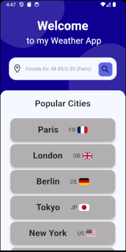
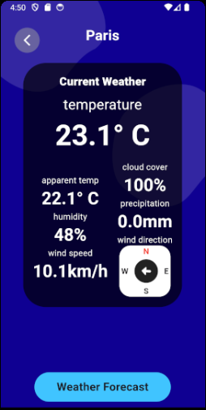
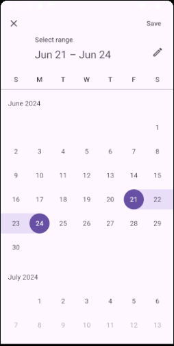
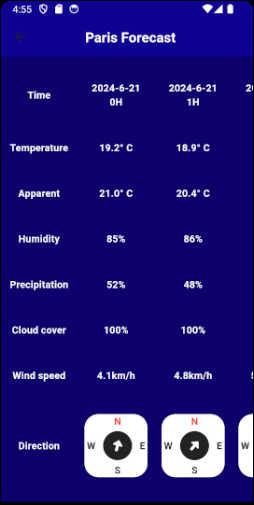

# flutter_weather_app

## Description
Cette application Flutter, pour appareil Android, récupère et affiche les données météorologiques en temps réel pour un emplacement spécifié basé sur les coordonnées géographiques (latitude et longitude). 
Les utilisateurs peuvent également sélectionner un intervalle de temps pour afficher les données météorologiques de cette période.

## Fonctionnalités
- Récupère les données météorologiques depuis l'[API Open-Meteo](https://open-meteo.com/).
- Affiche les informations météorologiques suivantes :
  - Température
  - Température ressentie
  - Humidité
  - Vitesse du vent
  - Direction du vent
  - Précipitations
  - Couverture nuageuse
- L'utilisateur peut entrer les coordonnées de latitude et de longitude.
- L'utilisateur peut sélectionner une plage de dates pour récupérer les données météorologiques pour une période spécifique.

## Captures d'écran

   Home Page                  Current Weather Page

        

 Date Range Select Page         Forecast Page

    

## Pour Commencer

### Prérequis
- Flutter SDK : Assurez-vous que Flutter est installé. Suivez le guide d'installation [ici](https://flutter.dev/docs/get-started/install).

### Installation
1. Clonez le dépôt :
   ```bash
   git clone https://github.com/Lucas34750/weather_app.git
